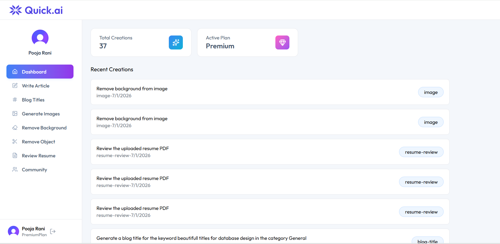
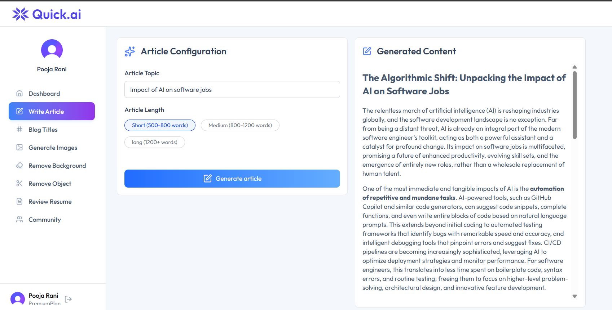
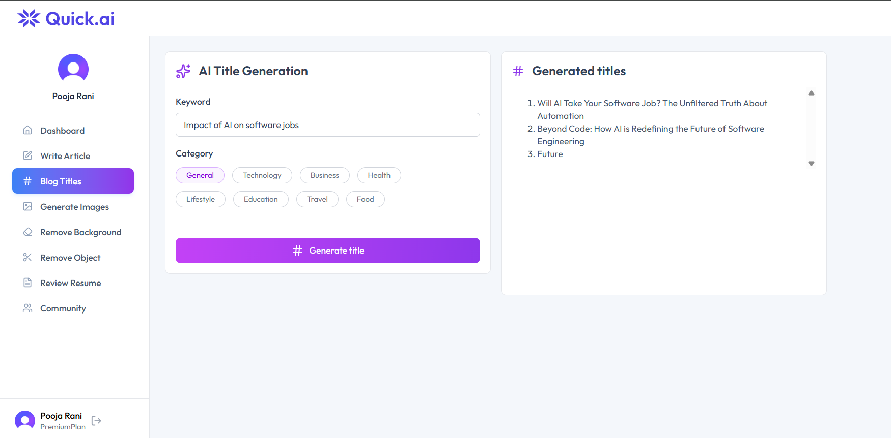
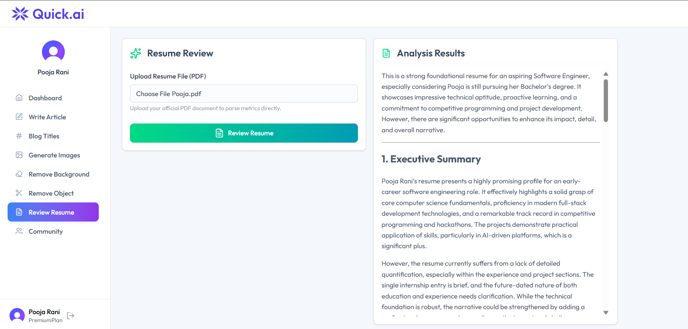
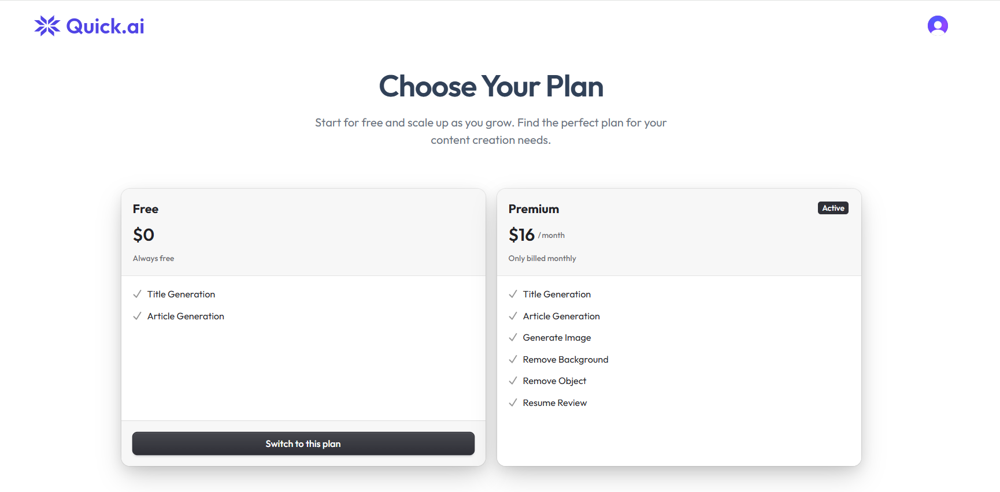

# 🚀 QuikAi - Full-Stack AI Production Workspace

QuikAi is a high-performance full-stack SaaS application that leverages advanced Large Language Models (LLMs) to automate content creation and optimize technical portfolios. Built with a decoupled client-server architecture, it delivers long-form text generation alongside platform-agnostic document analysis workflows.

---

## 📸 Core Features Showcase

### 1. Main Dashboard View
The primary navigation landing deck housing access routers to full-stack microservices metrics panels.


### 2. AI Article Generator
An executive-tier copywriting tool that takes prompt variables and targets length distributions dynamically to generate realized, production-ready copy with clean markdown layouts.


### 3. SEO Headline Copywriter (Blog Titles)
An advanced SEO brainstorming engine that analyzes topics to output 5 click-worthy, engagement-optimized, numbered blog headlines natively.


### 4. Native PDF Resume Auditor & Reviewer
A portfolio review suite that ingests user-uploaded PDF files, reads the file streams securely as a `Uint8Array` matrix, extracts structural texts, and processes an in-depth constructive recruiter critique.


### 5. Pricing Tiers & Subscription Plans
Flexible subscription mapping profiles handling premium package tier unlocks.


---

## 🛠️ Architecture Stack Configurations

### Frontend Client
- **Framework Suite**: ReactJS (Vite Build Bundle Engine)
- **Styling Utility**: Tailwind CSS (Utility-First Responsive Layouts)
- **Icons**: Lucide React
- **Authentication**: Clerk React SDK Security Layer
- **Network Pipeline**: Axios (JSON Structural Transmissions)

### Backend Core API
- **Runtime Environment**: Node.js Ecosystem Layer
- **REST Framework Wrapper**: Express.js Router Middleware
- **Identity Middleware**: Clerk Express Middleware Configuration
- **Asset Buffer Parser**: Multer File Stream Memory Allocations
- **Document Text Extractor**: PDF-Parse (Cross-Platform Uint8Array Matrix Buffers)
- **Artificial Intelligence Routing**: Google Gemini LLM API (Via OpenAI Integration Wrappers)
- **Primary Persistent Data Store**: PostgreSQL Database Client

---

## ⚙️ Local Development Environment Setup

Follow these setup steps to spin up the local environment clusters on your machine.

### 1. Repository Configuration
Clone the repository down into your computer:
```bash
git clone https://github.com
cd QuikAi
```

### 2. Backend Environment Environment Setup (`/server/.env`)
Create a file named `.env` inside your root `server` folder path and assign these tracking values:
```env
GEMINI_API_KEY=your_google_ai_studio_api_key_string
CLERK_SECRET_KEY=your_clerk_private_secret_token_signature
DATABASE_URL=your_postgresql_connection_string_uri
PORT=5000
```

### 3. Frontend Client Environment Setup (`/client/.env`)
Create a file named `.env` inside your root `client` folder path and assign these tracking variables:
```env
VITE_CLERK_PUBLISHABLE_KEY=your_clerk_public_publishable_key_string
VITE_BASE_URL=http://localhost:5000
```

### 4. Dependency Installations & Startup Execution
Open your terminal panel and boot the workspace subsystems concurrently:

```bash
# Terminal Tab A: Spin up the core Server API Layer
cd server
npm install
npm run dev

# Terminal Tab B: Spin up the client User View Framework
cd client
npm install
npm run dev
```

---

## 🔒 Security & Disk Sanitation Disclosures
- **Environment Sanitation**: All private API keys, tokens, and database URI strings are fully locked out of public version control structures using multi-tier `.gitignore` profiles.
- **Disk Space Preservation**: Temporary document upload buffers compiled by the Multer storage layer are instantly unlinked and permanently deleted from physical local server hard drives (`fs.unlinkSync`) immediately after text extraction parsing loops complete to protect system resources and user confidentiality.
